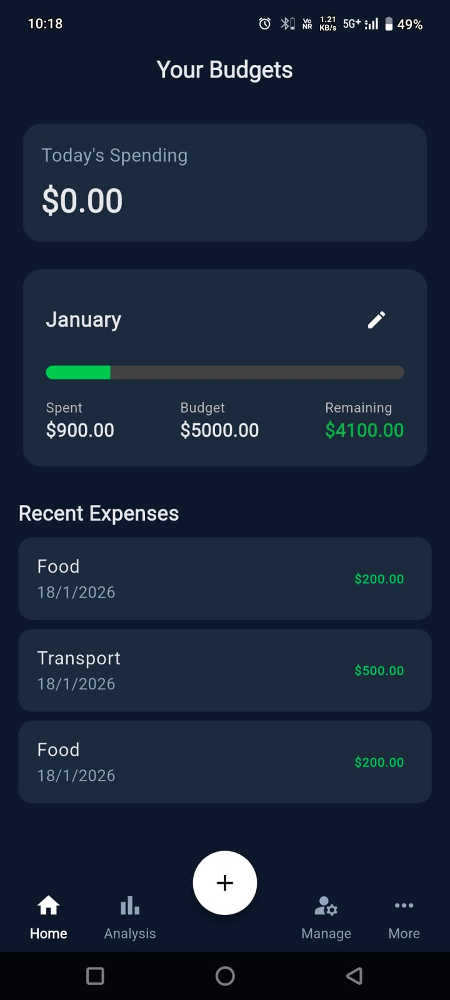
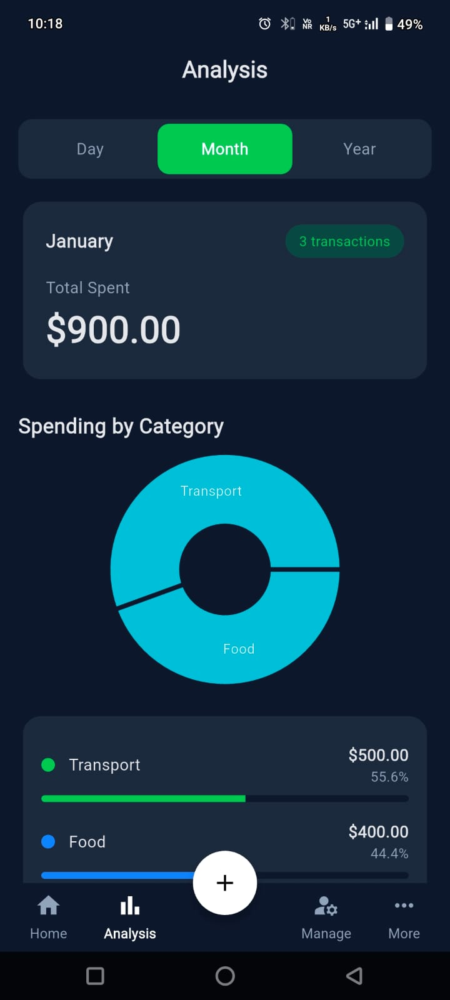
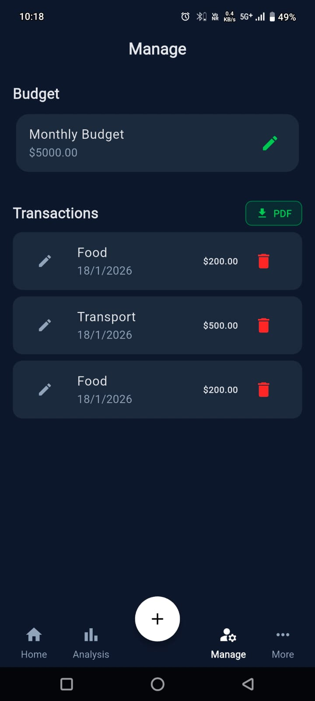
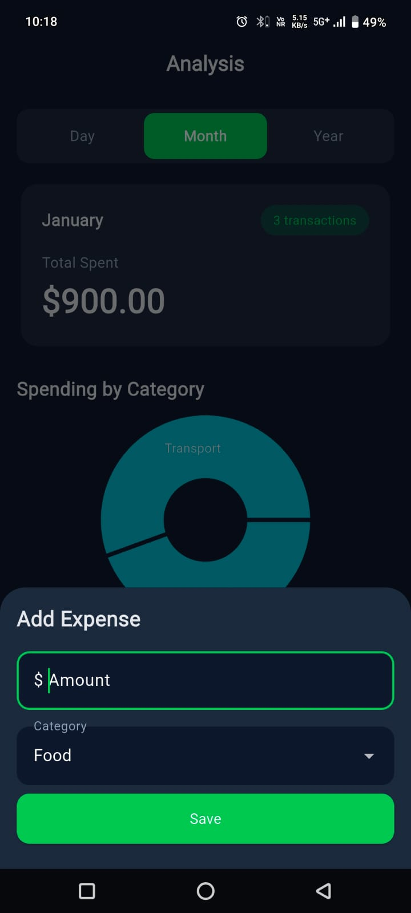
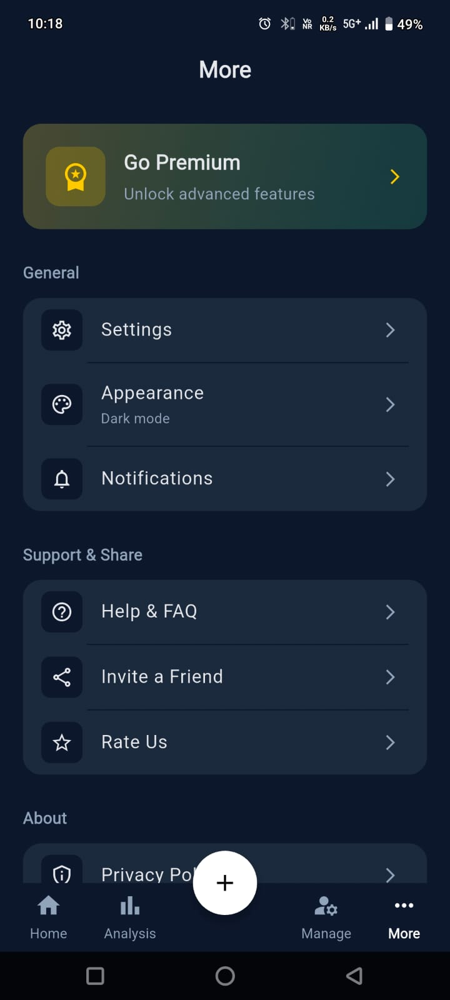

# SpendLite – Simple Budget & Expense Tracker 💸

A clean and minimal **Flutter-based Budget & Expense Tracker** app designed for students and working professionals who want to track expenses without complexity.

---

## 📱 App Overview

SpendLite helps users:
- Track daily expenses
- Set a monthly budget
- View category-wise spending analysis
- Stay fully offline with local storage

No login. No internet. No clutter.

---

## ✨ Features

- ➕ Add, edit & delete expenses  
- 📊 Monthly budget overview  
- 🍔 Category-wise spending (Food, Transport, Rent, etc.)  
- 🌙 Clean dark UI  
- 🔐 Offline-first (local storage only)  
- 📄 Export transactions as PDF (optional)

---

## 🧱 Tech Stack

- **Flutter**
- **State Management:** Provider / ValueNotifier
- **Local Storage:** SharedPreferences
- **Architecture:** Simple MVC / MVVM

---

## 📸 Screenshots

| Home | Analysis | Manage |
|------|----------|--------|
|  |  |  |

| Add Expense | More |
|-------------|------|
|  |  |

---

## 🎯 Target Users

- College Students  
- Young Working Professionals  
- Budget-conscious individuals  

---

## 🚫 Disclaimer

This app:
- Does **not** connect to any bank or financial institution  
- Does **not** collect or sync personal data  
- Stores all data locally on the device

---

## 🚀 Future Enhancements

- CSV / Excel export  
- Custom categories  
- Backup & restore  
- Advanced charts (Premium)

---

## 📦 APK

APK is available under **Releases** section.

---

## 👨‍💻 Author

**Om Mehta**  
- GitHub: https://github.com/ommehta4920  
- LinkedIn: https://linkedin.com/in/your-profile

---

⭐ If you like this project, consider giving it a star!
